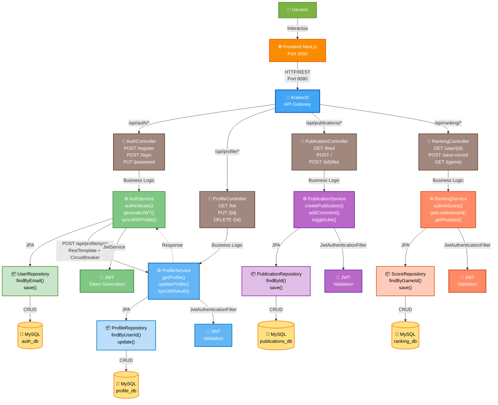

# Diagrama C3 - Arquitectura Mazanex (FINAL)

## Diagrama Completo - Todas las Capas



---

## 📐 Capas en Cada Microservicio

Cada microservicio tiene 4 capas:

```
┌─────────────────────────────────────────┐
│  🎯 LAYER 1: CONTROLLER                 │
│  Recibe HTTP requests del Gateway       │
│  Mapea rutas, valida DTOs              │
└────────────────────┬────────────────────┘
                     │
┌────────────────────▼────────────────────┐
│  ⚙️ LAYER 2: SERVICE                    │
│  Lógica de negocio                      │
│  Gestión de transacciones               │
│  Comunicación inter-servicio            │
└────────────────────┬────────────────────┘
                     │
┌────────────────────▼────────────────────┐
│  📦 LAYER 3: REPOSITORY                 │
│  Acceso a datos via JPA                 │
│  Queries a la BD                        │
└────────────────────┬────────────────────┘
                     │
┌────────────────────▼────────────────────┐
│  💾 LAYER 4: DATABASE                   │
│  MySQL con su schema independiente      │
│  Almacenamiento persistente             │
└─────────────────────────────────────────┘
```

---

## 📋 Resumen de Conexiones

### Conexiones por Microservicio

| Servicio | Puerto | Gateway | Conexiones Externas |
|----------|--------|---------|-------------------|
| **Auth Service** | 8081 | `/api/auth/*` | → Profile Service (sync) |
| **Profile Service** | 8082 | `/api/profile/*` | ← Auth Service (sync) |
| **Publications Service** | 8083 | `/api/publications/*` | Independiente |
| **Ranking Service** | 8084 | `/api/ranking/*` | Independiente |

### Endpoints Principales

#### Auth Service
- `POST /api/auth/register`
- `POST /api/auth/login`
- `GET /api/auth/users`
- `PUT /api/auth/{id}/password`
- `PUT /api/auth/profile/{id}`
- `DELETE /api/auth/{id}`

#### Profile Service
- `GET /api/profile/list`
- `POST /api/profile/sync` (recibe de Auth)
- `PUT /api/profile/{id}`
- `DELETE /api/profile/{id}`
- `GET /api/profile/social/*` (social features)

#### Publications Service
- `GET /api/publications/feed`
- `GET /api/publications/user/{userId}`
- `POST /api/publications`
- `POST /api/publications/{id}/like`
- `POST /api/publications/{id}/comment`
- `DELETE /api/publications/{id}`

#### Ranking Service
- `GET /api/ranking/user/{userId}`
- `GET /api/ranking/{game}`
- `POST /api/ranking/save-record`
- `POST /api/ranking/report/{id}`

---

## 🔌 Flujos de Datos Principales

### 1. Registro de Usuario
```
Frontend → KrakenD → Auth Service
                    ↓
            Guarda en auth_db
                    ↓
            Llama a ProfileService (/api/profile/sync)
                    ↓
            Profile Service guarda en profile_db
```

### 2. Login
```
Frontend → KrakenD → Auth Service
                    ↓
            Valida credenciales en auth_db
                    ↓
            Genera JWT Token
                    ↓
            Retorna token al Frontend
```

### 3. Consumir un Servicio Protegido
```
Frontend (con JWT en header)
    ↓
KrakenD
    ↓
Microservicio (cualquiera)
    ↓
JwtAuthenticationFilter valida localmente
    ↓
Controller procesa el request
    ↓
Service + Repository acceden a su DB
    ↓
Retorna respuesta al Frontend
```

---

## 🔐 Seguridad

- **JWT**: Generado por Auth Service, validado localmente en cada microservicio
- **Validación Local**: Cada servicio tiene su propio `JwtService` + `JwtAuthenticationFilter`
- **Sin comunicación remota para JWT**: No hay llamadas entre servicios para validar tokens
- **Circuit Breaker**: Protege la sincronización Auth ↔ Profile

---

## 📊 Capas Internas (igual en todos los servicios)

```
HTTP Layer
    ↓
@Controller (recibe requests)
    ↓
@Service (lógica de negocio)
    ↓
@Repository (acceso a datos - JPA)
    ↓
MySQL Database
```

---

## 📝 Notas Importantes

- El gateway enruta requests según el prefijo de ruta (`/api/auth/*` → Auth Service, etc.)
- Cada microservicio tiene su propia base de datos (sin compartir datos directamente)
- La sincronización Auth ↔ Profile es **asincrónica** y tiene **Circuit Breaker** para tolerancia a fallos
- JWT se valida **localmente** en cada microservicio, no hay comunicación remota
